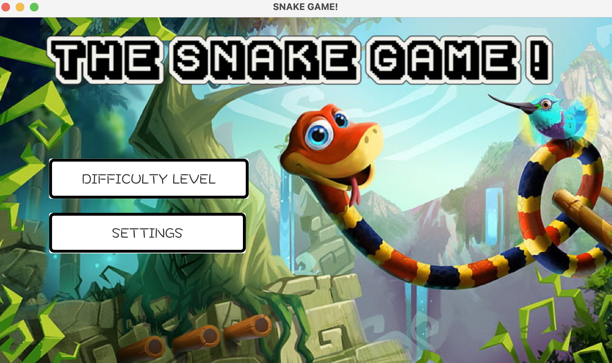
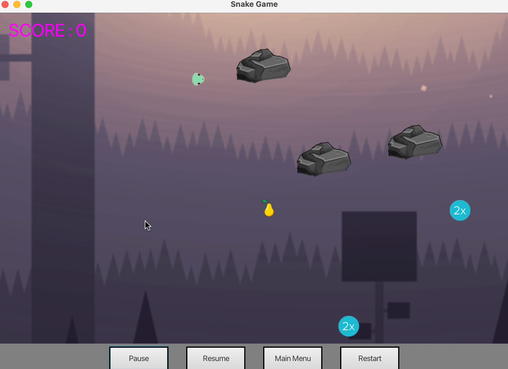

# THE SNAKE GAME 
The Snake Game project, coded in Java using JavaFX, presents a classic  gaming experience. Players navigate a snake through the game area, munching on food to extend its length while staying away from obstacles. The project integrates GUI elements and follows the Model-View-Controller (MVC) design pattern, emphasizing a structured software architecture. This implementation brings a engaging gameplay concept showcasing the intersection of classic gaming and current software development practices.

### INSTALLATIION AND RUNNING THE PROJECT
To install and run the Snake Game project, execute the HelloApplication class. The project utilizes JavaFX and Maven build tools. Ensure you have the required dependencies specified in the pom.xml file.

### GAME MANUAL 

Upon launching,you'll see buttons for "Difficulty Level" and "Settings." In the Settings, you can change the background color, but it won't impact the game since it uses an image background. Clicking "Difficulty Level" gives you options for "Easy" and "Hard." In Easy mode, grab fruits to up your score, but watch out for walls – hit them, and it's game over.

In Hard mode, stones and icons show up. Hitting stones ends the game, and hitting icons doubles your snake's speed. At the bottom, there's a panel for pausing, resuming, restarting, or going back to the main menu.

This engaging Snake Game combines classic gameplay with interactive features, providing players with a challenging and entertaining experience.

